# OrbitSM


## Enterprise IT Service Management Platform

OrbitSM is an enterprise IT Service Management platform designed for project-aware incident operations, workflow governance, SLA visibility, AI-assisted service intelligence, and executive reporting.

This public repository is a **showcase repository only**. It demonstrates product architecture, capabilities, screenshots, and engineering practices while intentionally excluding proprietary source code, environment files, schemas, credentials, AI prompts, and commercial implementation details.

## Public Showcase Site

This repository includes a public-safe static showcase page in [index.html](index.html). It can be published through GitHub Pages from the repository root.

Expected GitHub Pages URL after enabling Pages:

```text
https://sanjit-bose.github.io/orbitsm-showcase/
```

See [SEO and Indexing Plan](docs/SEO_AND_INDEXING_PLAN.md) for Google Search Console and indexing steps.

## Demo Video

The showcase site includes a public-safe narrated demo video:

```text
demo/video/orbitsm-demo.mp4
```

The video covers project-aware operations, dashboards, Kanban, situation intelligence, incident and task execution, AI-assisted service intelligence, RBAC/ABAC governance, admin configuration, and hardened deployment patterns. A transcript is available at [demo/video/orbitsm-demo-transcript.txt](demo/video/orbitsm-demo-transcript.txt).

## Product Overview

OrbitSM brings incidents, service requests, tasks, problems, changes, Assets & CMDB, SLA controls, Kanban operations, AI insights, customer/project scoping, and executive dashboards into a single service-management workspace.

The product is designed for organizations that need:

- Centralized ITSM operations across multiple projects and customer accounts.
- Configurable RBAC, ABAC, or Hybrid visibility for employees, leads, managers, executives, customers, and admins.
- AI-assisted triage, root cause analysis, similar-incident discovery, and knowledge generation.
- Production-ready deployment patterns with HTTPS, reverse proxy routing, connection pooling, and backend-only secrets.
- Audit-ready governance across incident, task, request, problem, and change lifecycles.

## Key Features

- Project-aware incident, task, service request, problem, and change management.
- OrbitSM incident management, OrbitSM AI-assisted RCA, OrbitSM situation intelligence, OrbitSM service health dashboards, and OrbitSM ITSM automation.
- Configurable access governance with RBAC, ABAC, and Hybrid modes for customer/account, hierarchy, project, requester, submitter, and assignee visibility.
- SLA definition, tracking, breach indicators, and operational health metrics.
- Standardized Assets & CMDB with asset/CI draft actions, inventory, ownership, lifecycle, relationships, guided import, service impact, and data-quality queues.
- Kanban board with workflow columns, prioritization, active situations, and ownership signals.
- AI-assisted RCA, categorization, similar-incident discovery, KEDB/KB generation, and service health insights.
- Problem management lifecycle from investigation to RCA, known error, workaround, fix, and closure.
- Change management lifecycle including approval, scheduling, implementation, rollback, and closure.
- Executive dashboards for SLA, MTTR, backlog, governance coverage, risk, and workload.
- Admin-led project, user, customer contact, email, RBAC/ABAC, and deployment configuration.
- Dockerized deployment patterns with HTTPS reverse proxy, private service networking, PostgreSQL, and API hardening.

## Architecture

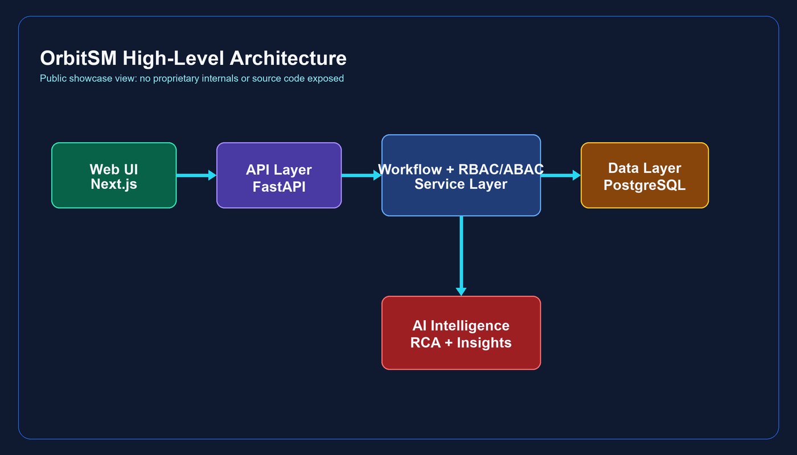

At a high level, OrbitSM uses a modern web architecture:

- **Frontend:** Next.js user interface.
- **Backend:** FastAPI service layer.
- **Runtime:** Gunicorn with Uvicorn workers.
- **Database:** PostgreSQL with SQLAlchemy connection pooling.
- **Edge:** Nginx reverse proxy, HTTPS, HSTS, and security headers.
- **AI:** Service intelligence layer for RCA, similarity, risk, categorization, and reporting signals.

See [Architecture Overview](docs/ARCHITECTURE.md) for details.

## Technology Stack

| Layer | Technology |
| --- | --- |
| Frontend | Next.js, React |
| Backend | Python, FastAPI |
| Application Runtime | Gunicorn, Uvicorn |
| Database | PostgreSQL |
| Data Access | SQLAlchemy connection pooling |
| Deployment | Docker, Docker Compose |
| Edge | Nginx reverse proxy, HTTPS |
| Security | Authentication, RBAC, ABAC, project/customer scoping, audit logging |
| AI Capabilities | RCA assistance, categorization, similarity, situation intelligence, KB generation |

## AI Capabilities

OrbitSM includes AI-assisted operational intelligence for:

- Root cause analysis support.
- Similar incident discovery.
- SLA risk and breach-prone work identification.
- Situation grouping and recurring-pattern detection.
- AI-generated knowledge article and KEDB drafts.
- Service health insights for dashboards and leadership reporting.

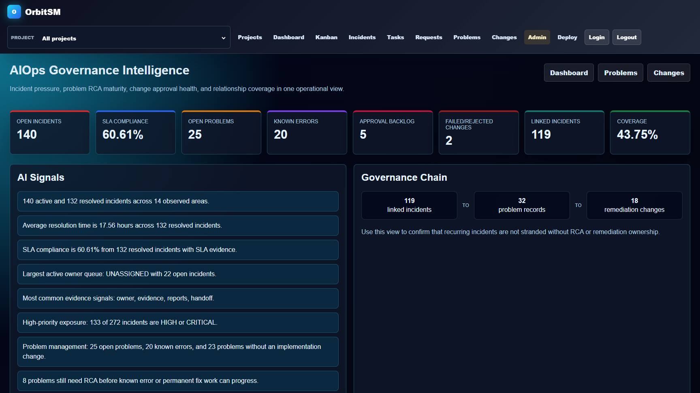

## Incident Management

Incident management provides operational intake, prioritization, ownership, SLA tracking, attachments, comments, status transitions, AI signals, and linkage to downstream problem/change governance.

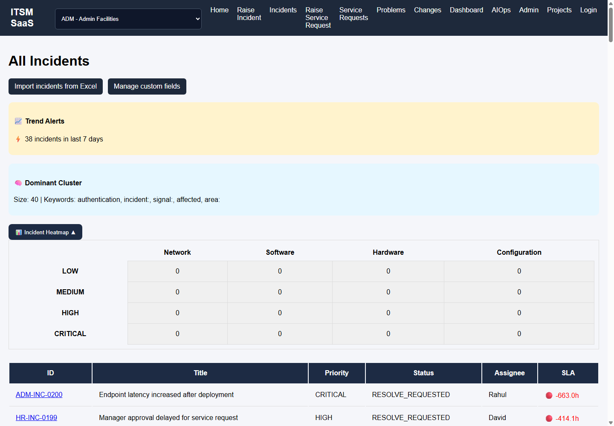

## Problem Management

Problem management supports structured RCA, known error tracking, workaround capture, permanent fix planning, linked incident clusters, and change creation for remediation.

## Change Management

Change management supports risk-aware approval, L1/CAB review, scheduling, implementation, rollback readiness, failure/rejection handling, and closure evidence.

## Assets & CMDB

Assets & CMDB gives customers a familiar ITSM implementation model: asset register, configuration item views, ownership, lifecycle state, linked services, service maps, guided imports, and data-quality queues. The UX includes quick actions for Add Asset, Add CI, Import, Service Map, View All, and CSV export so customers can understand the capability from the page itself. View All switches from highlighted rows into the complete 1,248-record demo inventory, while CSV export downloads all 1,248 rows.

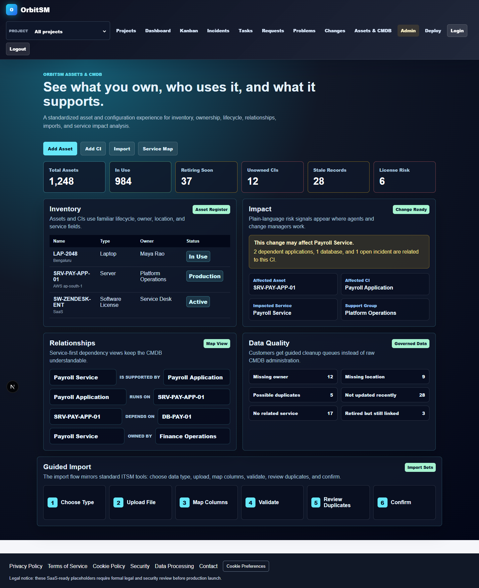

## Workflow Automation

OrbitSM models work through controlled lifecycle states, assignment rules, project reassignment, notifications, audit events, and Kanban-driven operational movement.

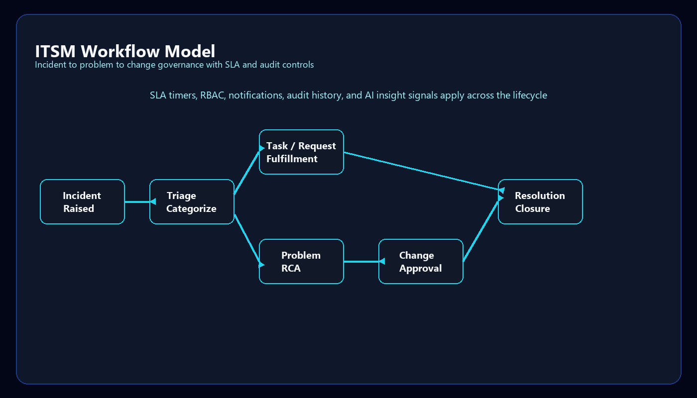

## Analytics & Reporting

Dashboards and reports provide service-level visibility across SLA, MTTR, open risk, workload, governance exceptions, problem maturity, approval health, and relationship coverage.

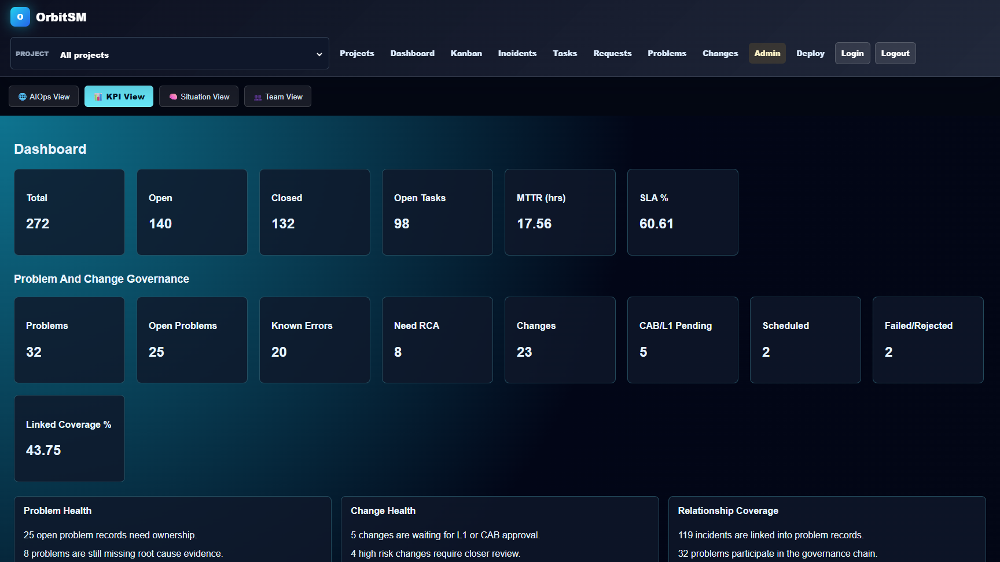

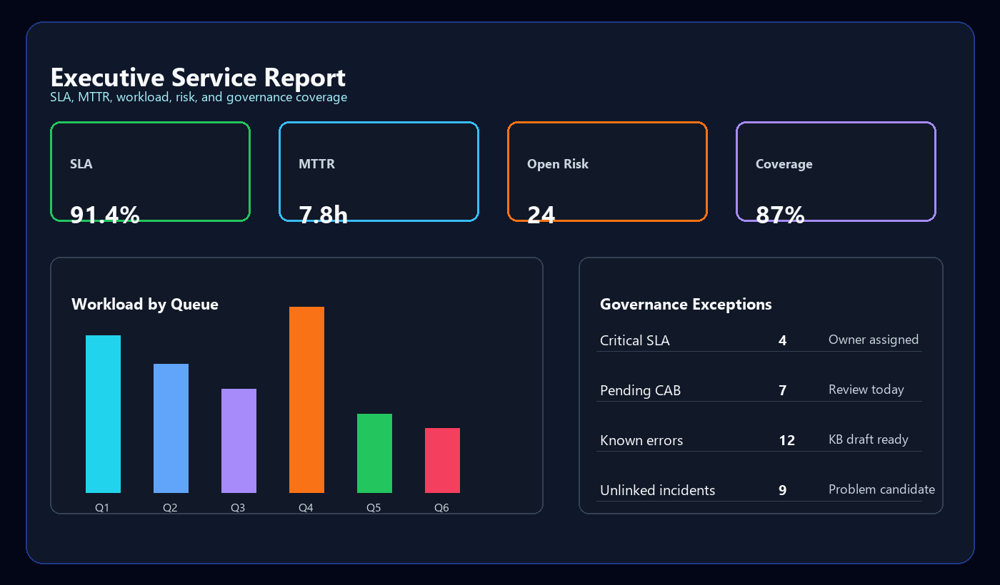

## Security Model

OrbitSM is designed around secure-by-default enterprise patterns:

- Login required for protected views and APIs.
- Role-based access control.
- Attribute-based access control for account, project, requester, submitter, assignee, customer contact, and manager hierarchy attributes.
- Hybrid access mode where RBAC and ABAC can be evaluated together.
- Project and customer account scoping.
- Manager/team hierarchy visibility.
- Backend authorization enforcement.
- HTTPS edge termination.
- Private backend/database network.
- Backend-only secrets.
- Audit events for workflow and admin actions.

See [Security Overview](docs/SECURITY_OVERVIEW.md).

## Deployment Options

OrbitSM supports multiple deployment models:

- Hardened HTTPS deployment with reverse proxy and private backend/database services.
- Blank database installation for a clean server deployment.
- Local demo/development deployment for product evaluation.
- Private Docker-based evaluation package for controlled demonstrations.


See [Deployment Overview](docs/DEPLOYMENT_OVERVIEW.md).

## Private Docker Demo Package

OrbitSM is designed to run as a containerized platform with web, API, database, reverse proxy, and notification services.

The Docker image/package is **not published in this public showcase repository** because it may contain proprietary implementation layers, deployment topology, runtime configuration, and commercial IP. A sanitized or private evaluation package can be shared separately for controlled demonstrations.

This public repository focuses on architecture, product capabilities, screenshots, engineering practices, and product vision without exposing commercial source code.

## Screenshots

| Area | Preview |
| --- | --- |
| Dashboard |  |
| Incidents |  |
| Kanban | 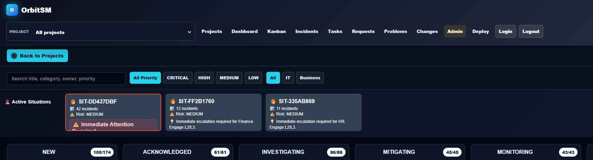 |
| AI Insights |  |
| AI Assistant Concept | 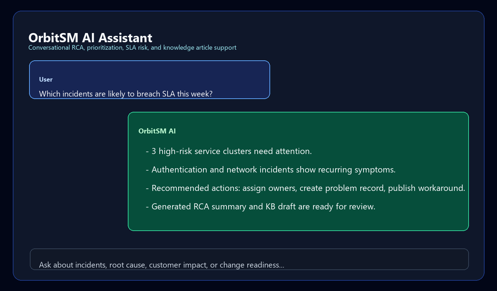 |
| Reports |  |
| Assets & CMDB |  |
| Assets & CMDB Mobile | 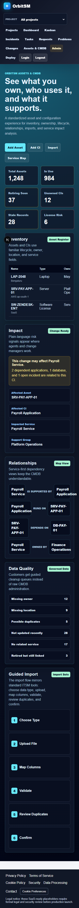 |
| RBAC / ABAC Access Model | 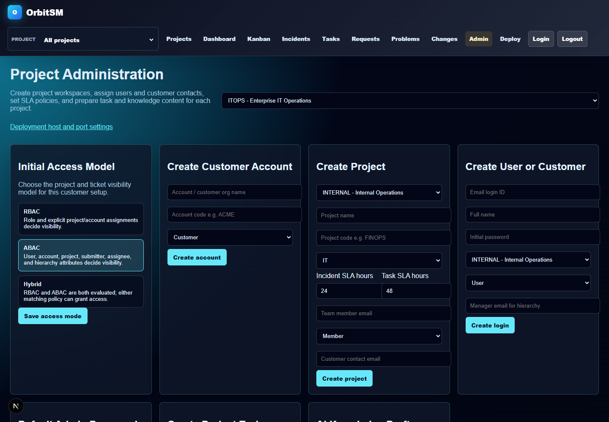 |
| RBAC / ABAC Deployment Setting | 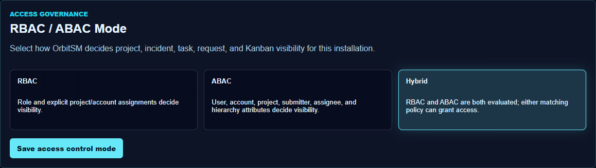 |

Additional LinkedIn-ready screenshots are available in [`screenshots/linkedin-campaign`](screenshots/linkedin-campaign).
See [Screenshot Guide](docs/SCREENSHOT_GUIDE.md) for a recommended carousel order.

## Future Roadmap

Planned direction includes:

- Deeper AI copilot workflows for service desk, problem managers, and change approvers.
- More advanced customer portal experiences.
- Observability integrations for event-driven incident generation.
- Expanded reporting exports for leadership and compliance reviews.
- SSO/OAuth enterprise identity integrations.
- Advanced audit evidence packs for regulated environments.

See [Product Roadmap](docs/PRODUCT_ROADMAP.md).

## Public Growth Assets

- [LinkedIn Project Entry](docs/LINKEDIN_PROJECT_ENTRY.md)
- [SEO and Indexing Plan](docs/SEO_AND_INDEXING_PLAN.md)
- [LinkedIn Post Draft](docs/LINKEDIN_POST_DRAFT.md)
- [Screenshot Guide](docs/SCREENSHOT_GUIDE.md)

## Repository Boundary

This repository does **not** include:

- Backend source code.
- Frontend source code.
- Environment files.
- Docker Compose files.
- Docker image layers or installation bundles.
- Database schema migrations.
- Credentials or secrets.
- AI prompts.
- Proprietary algorithms.
- Commercial implementation details.

Included demo files are generic examples only and are not functional product code.
