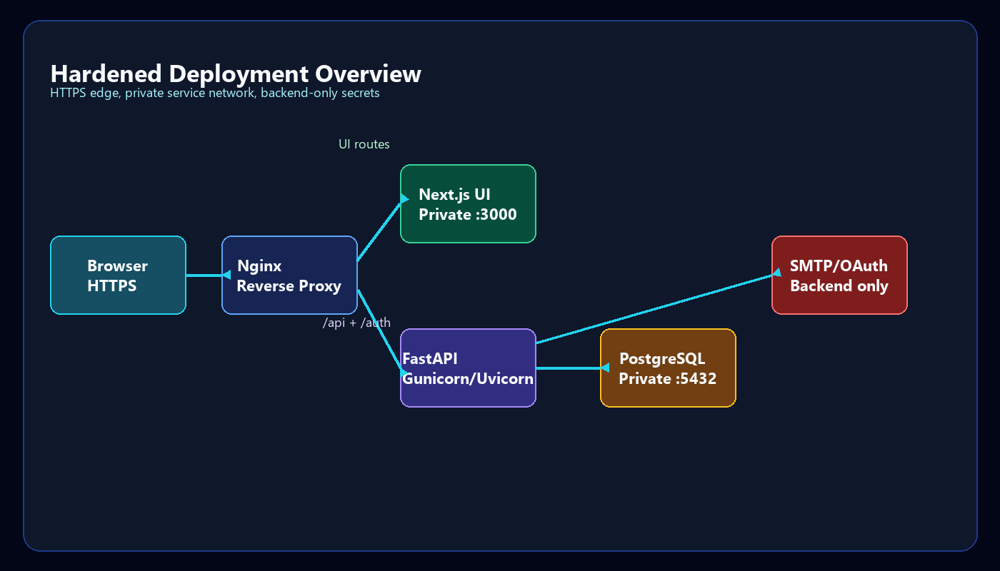

# Deployment Overview

OrbitSM is designed for containerized deployment and enterprise-ready runtime hardening.

This public document explains deployment concepts without including operational secrets, environment files, Compose files, certificates, or proprietary runtime configuration.

## Recommended Production Pattern

The preferred production topology places a reverse proxy at the edge and keeps application services private:

1. Browser traffic enters over HTTPS.
2. Nginx routes UI requests to the frontend service.
3. Nginx routes API/auth/work-item requests to the backend service.
4. Backend services connect to PostgreSQL through a pooled database layer.
5. Secrets remain in server-side configuration only.
6. Email/OAuth providers are accessed by backend services, not browser code.

## Deployment Options

| Mode | Purpose |
| --- | --- |
| Hardened production | HTTPS, reverse proxy, private backend/database services, backend-only secrets |
| Blank install | Clean database setup for a new server or demo environment |
| Local demo | Product walkthrough and internal testing |
| Private Docker evaluation package | Controlled sharing for demos without publishing commercial implementation assets |

## Private Docker Demo Package

OrbitSM can be packaged for Docker-based evaluation, but that package is intentionally not included in this public repository.

The public-safe position is:

- Do not publish Docker image folders or image layers in this showcase repository.
- Do not publish Compose files, environment files, certificates, secrets, or install bundles here.
- Share Docker-based demos privately only after sanitizing configuration, seed data, credentials, and commercial implementation details.
- Use this repository to explain the containerized deployment model without exposing the actual deployment artifacts.

## Runtime Components

- Web frontend.
- API backend.
- PostgreSQL database.
- Reverse proxy.
- Email/OAuth provider integrations.
- AI intelligence services.

## Scaling Considerations

Production scaling focuses on:

- Worker count.
- Database connection pool sizing.
- Reverse proxy routing.
- Database capacity.
- Background notification and AI workloads.
- Observability and alerting.

## Public Repository Boundary

Deployment source files and Docker image folders are intentionally excluded from this showcase repository. This prevents accidental exposure of implementation structure, environment defaults, secrets, internal ports, image layers, and commercial runtime details.
